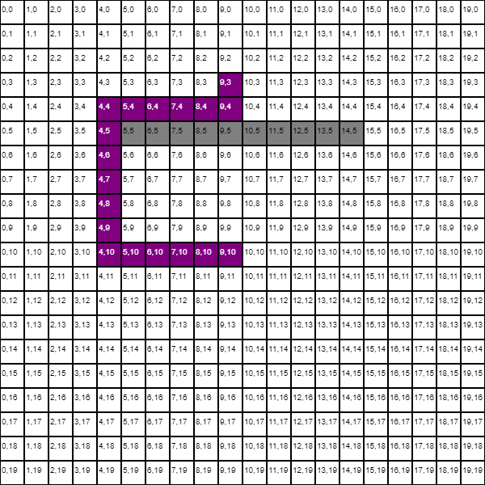

# JavaScript A* Pathfinding Algorithm

This is a JavaScript implementation of the [A*][astar] search algorithm. It uses the HTML5 canvas to display the graph and show the pathfinding. This implementation uses the [Manhattan Distance][manhat] heuristic but could be modified to use another heuristic. It uses one list instead of two for the implementation of open list and closed list. Where the closed list is replaced with a bit on each node. It could be modified to use a Priority Queue or Binary Heap to become faster.

## Example

## References
- https://briangrinstead.com/blog/astar-search-algorithm-in-javascript/
- https://en.wikipedia.org/wiki/A*_search_algorithm
- https://brilliant.org/wiki/a-star-search/
- https://www.redblobgames.com/pathfinding/a-star/introduction.html

## License
[MIT][License]

[astar]: https://en.wikipedia.org/wiki/A*_search_algorithm
[manhat]: https://en.wikipedia.org/wiki/Taxicab_geometry
[license]: https://choosealicense.com/licenses/mit/
